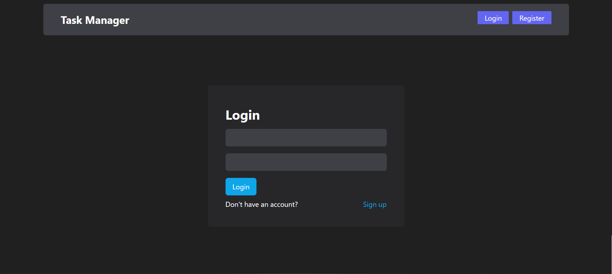
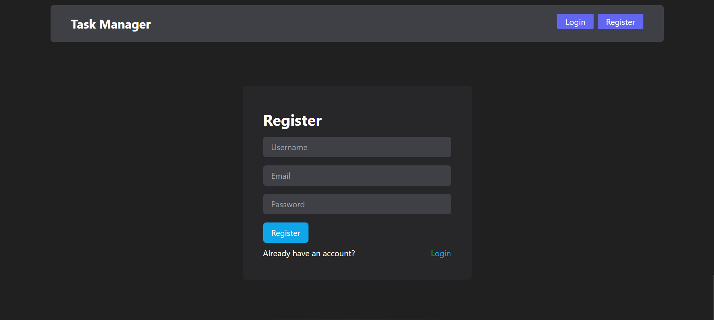
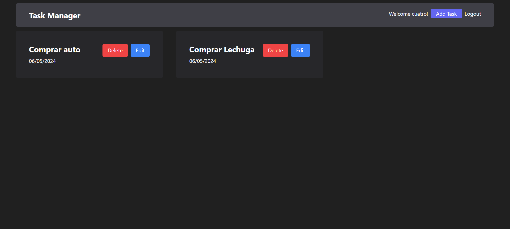
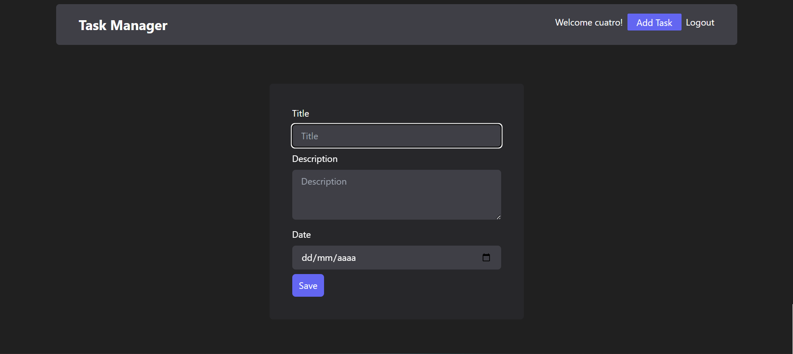

<h1 align='center'>🌟 TaskManager 🔐🔄📊🌟</h1>

> Práctica de HTML, CSS, JavaScript, React, Node.js, Express, MongoDB y Tailwind. ✨

🎯 Objetivo: Desarrollar una aplicación de gestión de tareas con sistema de usuarios, CRUD y base de datos en MongoDB.

Esta idea de proyecto está inspirada en el video "[Nodejs React Mongodb Login y CRUD (Aplicación FullStack)](https://youtu.be/NmkY4JgS21A?si=qWD6Td1IJp2UYNN6)" de [Fazt Code](https://www.youtube.com/@blackcode2).

Utilicé este video como tutorial para aprender a crear un sistema de usuarios, realizar operaciones CRUD y configurar una base de datos con MongoDB. Además, utilicé los comentarios para registrar y explicar lo que iba aprendiendo, lo que me permitió interiorizar los conocimientos de manera más efectiva.

### Instalación y ejecución del back end del proyecto (Node.js y Express) 🛠️💻

Sigue estos pasos para clonar y ejecutar el back end del proyecto localmente:

1. Abre la consola en la ubicación deseada para clonar el repositorio.

2. Clona este repositorio en tu máquina local utilizando Git:

    ```bash
    git clone https://github.com/Schugu/mern-crud-auth.git
    ```

3. Navega al directorio del proyecto clonado:

    ```bash
    cd mern-crud-auth
    ```

4. Instala las dependencias del back end utilizando npm o yarn:

    ```bash
    npm install
    # o
    yarn
    ```

5. Inicia el servidor del back end utilizando npm:

    ```bash
    npm run dev // Esta configurado para que sea así en el package.json 
    ```

7. Una vez que el servidor del back end esté en funcionamiento, puedes proceder con la instalación y ejecución del front end.

### Instalación y ejecución del front end del proyecto (React) 🛠️💻

Sigue estos pasos para ejecutar el front end del proyecto localmente:

1. Abre otra consola o terminal en la ubicación del proyecto clonado.

2. Navega al directorio del front end:

    ```bash
    cd client
    ```

3. Instala las dependencias del front end utilizando npm o yarn:

    ```bash
    npm install
    # o
    yarn
    ```

4. Inicia el servidor de desarrollo del front end utilizando npm:

    ```bash
    npm run dev
    ```

5. Una vez que el servidor de desarrollo del front end esté en funcionamiento, abre tu navegador web y navega a la dirección local para ver el proyecto en acción.

### Personalización y comprensión del proyecto 🎨🧠

Para personalizar y comprender el proyecto, sigue estas instrucciones:

- **Back end**: Si deseas modificar o entender cómo funciona el back end, te recomiendo revisar los archivos. La lógica de la aplicación se encuentra principalmente en estos archivos.

- **Front end**: Si deseas modificar o entender cómo funciona el front end, te recomiendo revisar los archivos y carpetas dentro de `src`. La lógica de la aplicación se encuentra principalmente en los archivos `App.jsx` y `Main.jsx`, mientras que los componentes individuales se encuentran en la carpeta `src/components`.


# Mis anotaciones
## Backend 
### Estructura de Carpetas y Archivos del Backend

**Carpetas:**

- **Src/Routes**: Definición de endpoints o rutas que el Frontend puede solicitar.
- **Src/Controllers**: Funciones que se ejecutan al visitar una URL.
- **Src/Models**: Modelos de datos de la base de datos, donde se crean esquemas.
- **Src/Middlewares**: Funciones para proteger rutas, especialmente para usuarios autenticados.
- **Src/Schemas**: Esquemas para validar datos.
- **Src/Libs**: Código reutilizable que se puede importar varias veces.

**Archivos:**

- **App.js**: Configuración de Express del Backend.
- **Db.js**: Configuración de la base de datos.
- **Config.js**: Archivo para crear configuraciones que otros archivos puedan importar.
- **Index.js**: Punto de entrada de la aplicación.
- **./Models/User.model.js**: Especificación de los datos que se guardarán en MongoDB.
- **./Routes/Auth.routes.js**: Rutas relacionadas con la autenticación.
- **./Controllers/Auth.controller.js**: Funciones relacionadas con la autenticación.
- **./Libs/Jwt.js**: Genera un JSON Web Token.
- **./Middlewares/ValidateToken.js**: Función para validar si el usuario está autenticado.
- **./Controllers/Tasks.controllers.js**: Funciones para manejar las tareas.
- **./Models/Task.model.js**: Modelo para las tareas.
- **./Schemas/Auth.schemas.js**: Esquema para la autenticación.
- **./Middlewares/ValidatorMiddleware.js**: Middleware para validar con los esquemas.
- **./Schemas/Task.schema.js**: Esquema para las tareas.

### Anotaciones Importantes

1. Al importar archivos que creamos, debemos incluir la extensión (.js).
2. Para evitar mezclar las rutas del Frontend y del Backend, se debe agregar '/api' a las rutas del Backend en App.js.
3. Los middlewares son funciones que se ejecutan antes de llegar a una ruta.

### Módulos Utilizados

- **Nodemon**: Para automatizar la reinicialización del servidor durante el desarrollo.
- **Morgan**: Para registrar las peticiones que llegan al Backend en la consola.
- **Mongoose**: Para conectarse y modelar los datos en MongoDB.
- **Dotenv**: Para importar variables de entorno de un archivo .env.
- **Bcryptjs**: Para encriptar contraseñas.
- **JsonWebToken**: Para crear tokens de sesión.
- **Cookie-parser**: Para convertir cookies en objetos JSON.
- **Zod**: Para validar datos comparándolos con un esquema.
- **Cors**: Para configurar CORS fácilmente.


## Frontend
### Anotaciones Importantes

1. Para evitar errores de CORS, se debe instalar un módulo en el Backend.

### Módulos Utilizados

- **React-router-dom**: Para crear y gestionar las rutas.
- **React-hook-form**: Para validar datos de formularios y manejar cambios de estado.
- **Axios**: Biblioteca para realizar peticiones HTTP.
- **Js-cookie**: Para leer cookies.
- **Dayjs**: Para manipular fechas en distintos formatos.

### Archivos

- **./Src/Api/auth.js**: Para realizar peticiones al Backend relacionadas con la autenticación.
- **./Src/Context/AuthContext.jsx**: Contexto para almacenar datos de autenticación del usuario.
- **./Src/Api/axios.js**: Archivo de configuración para Axios.
- **./Src/Api/tasks.js**: Para realizar peticiones al Backend relacionadas con las tareas.

### Capturas de pantalla 📸






